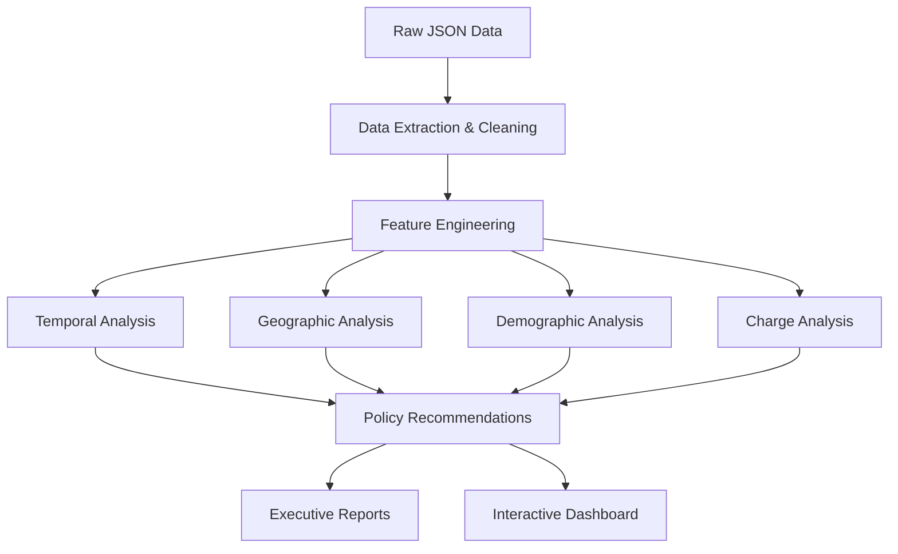

# Municipal Court Case Analysis: Data-Driven Policy Solutions

[](https://www.python.org/)
[](https://pandas.pydata.org/)
[](LICENSE)
[]()

> Comprehensive analysis of 19,906 municipal court cases to identify operational inefficiencies, data quality gaps, and policy improvement opportunities with $263K+ potential annual savings.

## 🎯 Project Overview

This project analyzes one month (October 2025) of municipal court case data from Austin, TX to provide evidence-based policy recommendations for court operations improvement. The analysis uncovered critical findings including an 89.5% demographic data gap, 68.3% active case backlog, and significant resource allocation opportunities.

**Live Demo:** [View Interactive Dashboard](https://shahanahmed.com/projects/municipal-court-analysis)

## 📊 Key Findings

- **88.1%** of cases are parking violations (17,547 cases) - straining court resources
- **89.5%** missing demographic data - preventing comprehensive equity analysis
- **68.3%** active case rate - indicating processing efficiency concerns
- **$263K** potential annual savings through parking diversion programs
- **17.5%** weekend enforcement vs 28.6% time availability - resource misalignment

## 💡 Policy Recommendations

| Priority | Recommendation | Timeline | Impact |
|----------|---------------|----------|--------|
| 🔴 **HIGH** | Mandate demographic data collection | 30 days | Enable bias detection & equity analysis |
| 🔴 **HIGH** | Review case processing efficiency | 60 days | Resolve 13,586 pending cases faster |
| 🟠 **MEDIUM** | Implement parking diversion programs | 90 days | Save $263K annually, reduce burden 30% |
| 🟠 **MEDIUM** | Enhance school zone safety enforcement | 30 days | Improve child safety near schools |
| 🟢 **LOW** | Optimize weekend enforcement patterns | 120 days | Better resource allocation |

## 🛠️ Technology Stack

**Data Processing & Analysis:**
- Python 3.x
- Pandas & NumPy
- JSON data parsing
- Statistical analysis

**Visualization:**
- Matplotlib
- Seaborn
- Custom dashboards

**Web Dashboard:**
- React/TypeScript
- Tailwind CSS
- Next.js
- Lucide React (icons)

## 📁 Project Structure
```
Case_load_Project/
│
├── data/
│   └── case_loads.json              # Source data (19,906 cases)
│
├── scripts/
│   ├── load_and_explore.py          # Initial data exploration
│   ├── policy_analysis.py           # High-level policy analysis
│   ├── comprehensive_analysis.py    # Detailed statistical analysis
│   ├── geographic_analysis.py       # Location-based patterns
│   └── executive_materials.py       # Report generation
│
├── output/
│   ├── cases_full.csv               # Complete dataset
│   ├── location_hotspots.csv        # Geographic concentration
│   ├── charge_analysis.csv          # Violation breakdown
│   ├── agency_performance.csv       # Enforcement metrics
│   ├── corridor_analysis.csv        # Street-level patterns
│   ├── area_analysis.csv            # District analysis
│   └── policy_recommendations.csv   # Actionable recommendations
│
├── visualizations/
│   ├── executive_dashboard.png      # Main dashboard
│   ├── temporal_analysis.png        # Time-based patterns
│   └── geographic_analysis.png      # Location visualizations
│
├── reports/
│   ├── Executive_Summary_Report.txt # Full analysis report
│   └── Policy_Brief_One_Pager.txt   # Stakeholder summary
│
└── website/
    └── MunicipalCourtAnalysis.tsx   # Interactive web dashboard
```

## 🚀 Getting Started

### Prerequisites
```bash
Python 3.8+
Pandas 2.0+
Matplotlib 3.7+
Seaborn 0.12+
NumPy 1.24+
```

## 📈 Analysis Workflow


## Sample Insights

### Case Type Distribution
```
Parking (PK):    17,547 cases (88.1%)
Traffic (TR):     1,645 cases (8.3%)
Ordinance (OR):     366 cases (1.8%)
Disabled (CP):      238 cases (1.2%)
Non-Traffic (NT):   110 cases (0.6%)
```

### Top Violations
1. Parking - No Payment For Metered Space: 11,007 (55.3%)
2. Parking - Tow Away Zone: 2,077 (10.4%)
3. Parking - Resident Only Zone: 1,024 (5.1%)
4. Parking - Left Wheel To Curb: 813 (4.1%)
5. Failed Financial Responsibility: 389 (2.0%)

### Temporal Patterns
- **Peak Days:** Wednesday (20.3%), Thursday (20.6%)
- **Peak Hours:** 8:00-9:00 AM (1,531 cases)
- **Weekend Share:** 17.5% of total enforcement

### Geographic Hotspots
- **Top Corridor:** South Congress Avenue (1,413 cases, 7.1%)
- **Primary Area:** Downtown Core (2,700+ cases)
- **High-Intensity Zones:** 20 locations with 100+ cases each

## 📄 Data Dictionary

| Field | Type | Description |
|-------|------|-------------|
| `Offense Case Type` | String | PK=Parking, TR=Traffic, OR=Ordinance, CP=Disabled, NT=Non-Traffic |
| `Offense Date` | DateTime | Date violation occurred |
| `Offense Time` | Time | Time violation occurred |
| `Violation Charge Code` | Integer | Numeric code for violation |
| `Offense Charge Description` | String | Full violation description |
| `Offense Street Name` | String | Location of violation |
| `School Zone` | Boolean | Whether in school zone |
| `Case Closed` | String | ACT=Active, TERM=Terminated |
| `Race` | String | Defendant race (89.5% missing) |
| `Defendant Gender` | String | Defendant gender (89.4% missing) |
| `Agency` | String | Enforcement agency |
| `Officer Code` | Integer | Issuing officer ID |

## Business Impact

### Financial Projections
- **Parking Revenue:** $614,145 annually (maintained)
- **Processing Costs:** $880K/year (current)
- **Potential Savings:** $263K/year through 30% diversion
- **Net Improvement:** +$263K annually

### Operational Improvements
- Reduce active case rate from 68.3% to 50%
- Improve case resolution time by 30%
- Free up court resources for complex cases
- Enable comprehensive equity monitoring

## Skills Demonstrated

**Technical:**
- Complex data pipeline development
- Statistical analysis & pattern recognition
- Data visualization & dashboard design
- ETL processes for nested JSON structures
- Feature engineering & data cleaning

**Analytical:**
- Policy impact analysis
- Root cause identification
- Predictive insights generation
- Data quality assessment

**Business:**
- Financial modeling & ROI calculation
- Stakeholder communication
- Evidence-based recommendations
- Executive reporting

## 📚 Reports & Deliverables

- ✅ Executive Summary Report (5 pages)
- ✅ Policy Brief One-Pager
- ✅ Interactive Web Dashboard
- ✅ 8 CSV Data Files
- ✅ 3 Visualization Sets
- ✅ Complete Source Code
- ✅ Technical Documentation

## 🔮 Future Enhancements

**Short-term (1-3 months):**
- [ ] Real-time data integration via API
- [ ] Automated monthly reporting
- [ ] Geographic heat map with actual coordinates
- [ ] Data quality monitoring dashboard

**Medium-term (3-6 months):**
- [ ] Predictive modeling for case volumes
- [ ] Time series forecasting
- [ ] Equity metrics once data available
- [ ] Mobile-responsive dashboard improvements

**Long-term (6-12 months):**
- [ ] Machine learning for case outcome prediction
- [ ] NLP analysis of case descriptions
- [ ] Optimization algorithms for resource allocation
- [ ] Public transparency dashboard

## License

This project is licensed under the MIT License - see the [LICENSE](LICENSE) file for details.

## Author

**Shahan**
- Data Scientist & ML Engineer
- Website: [shahanahmed.com](https://shahanahmed.com)
- LinkedIn: [linkedin.com/in/shahan24h](https://linkedin.com/in/yourprofile)
- Email: shahan24h@gmail.com

## Acknowledgments

- Data provided by Austin Open Data Portal
- Municipal court system stakeholders
- Policy research community

## Contact

For questions, collaborations, or consulting inquiries:
- 📧 Email: shahan24h@gmail.com
- 🌐 Website: [shahanahmed.com](https://shahanahmed.com)
- 💼 LinkedIn: [shahan24h](https://linkedin.com/in/shahan24h)

---

**⭐ Star this repository if you found it helpful!**

**🔗 [Live Demo](https://shahanahmed.com/projects/municipal-court-analysis)** | **📄 [Full Report](reports/Executive_Summary_Report.txt)** | **📊 [Interactive Dashboard](https://shahanahmed.com/projects/municipal-court-analysis)**

---

*Project completed: November 2025*  
*Analysis period: October 2025*  
*Dataset: 19,906 municipal court cases*
